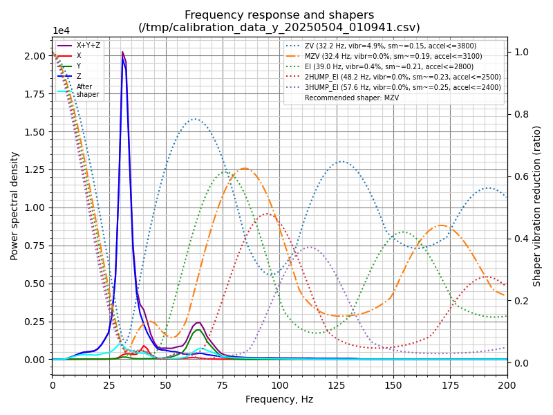

# Creality CP-01 3D Printer with Klipper
Since no one else is providing support, I decided to take matters into my own hands.

## Before You Start
If you don’t already own a 3D printer, do not buy this model. Creality has discontinued all support for the CP-01, and you won’t even find it listed in their own slicer software. If you already own one and need help modifying it, this repository will be useful.
Make sure you have a Raspberry Pi or another single-board computer (SBC) ready to use as the host.

## Flashing Klipper
Flashing Klipper onto your printer is straightforward: simply select avrmega2560 as the target. The challenging part is creating a configuration file for your printer. Unfortunately, there are no pre-made configurations for the CP-01 available online. However, you can now use the configuration I’ve provided: CP-01 Config ([configs/printer-cp01.cfg](configs/printer-cp01.cfg)).

## Bed Leveling
If you’re new to Klipper, note that there is no screen interface for bed leveling. Instead, you’ll need to use the ```BED_SCREWS_ADJUST``` command.
For more details, refer to the official Klipper documentation: Manual Leveling.

## TMC Driver Feature
It’s recommended to solder a jumper wire to enable this feature. Klipper prints models at higher speeds, which can increase pressure on the extruder and potentially cause the TMC driver to crash. If you’re running in standalone mode, you won’t receive any error reports; the printer will continue idling, and you may notice the extruder stops extruding material. For more information, see this GitHub issue: Klipper Issue [#3738](https://github.com/Klipper3d/klipper/issues/3738#issuecomment-757184030).


## Measuring Resonances



I’ve measured the resonances on my own CP-01 and used the data to configure the input shaper. I’m not sure if these measurements will work for your machine, but I’ve included them in the configuration. If you’re not satisfied or have your own ADXL345 accelerometer, you can measure the resonances yourself.


## Pressure Advance
Unfortunately, the CP-01 cannot enable the Pressure Advance feature. The Creality Silent Board v2.5.2 uses TMC2208 drivers, and it’s unclear whether the MCU or the drivers are unable to support this feature.
There are several reports about this issue:

- Klipper Issue [#870](https://github.com/Klipper3d/klipper/issues/870)
- Marlin Issue [#20688](https://github.com/MarlinFirmware/Marlin/issues/20688)

In my experience, even when the system doesn’t crash, the extruder behaves erratically and often over-extrudes.

If you know how to enable this feature and without any quality issue, please let me know. I really wannt know how to enable without any quality issue.


## Changing the Extruder Stepper

The default CP-01 extruder stepper is outdated and difficult to source, making direct replacement challenging. If your setup lacks the TMC UART feature, replacing the stepper can be risky. If the replacement stepper has a lower resistance, the TMC driver will detect it and issue a warning. If you haven't soldered a jumper wire to enable the UART function, it's best to skip this step to avoid damaging the driver.

If you decide to replace the stepper, use a multimeter to verify the wiring of the original stepper. Adjust the wiring order as needed to ensure proper functionality.

### Summary

The stock extruder is highly inefficient. Replacing the extruder stepper can significantly improve the printer's maximum acceleration (`max_accel`) and maximum velocity (`max_velocity`). While the XYZ axes can handle higher speeds, the extruder remains a bottleneck. The most effective solution is to replace the entire extruder rather than just upgrading its stepper motor.